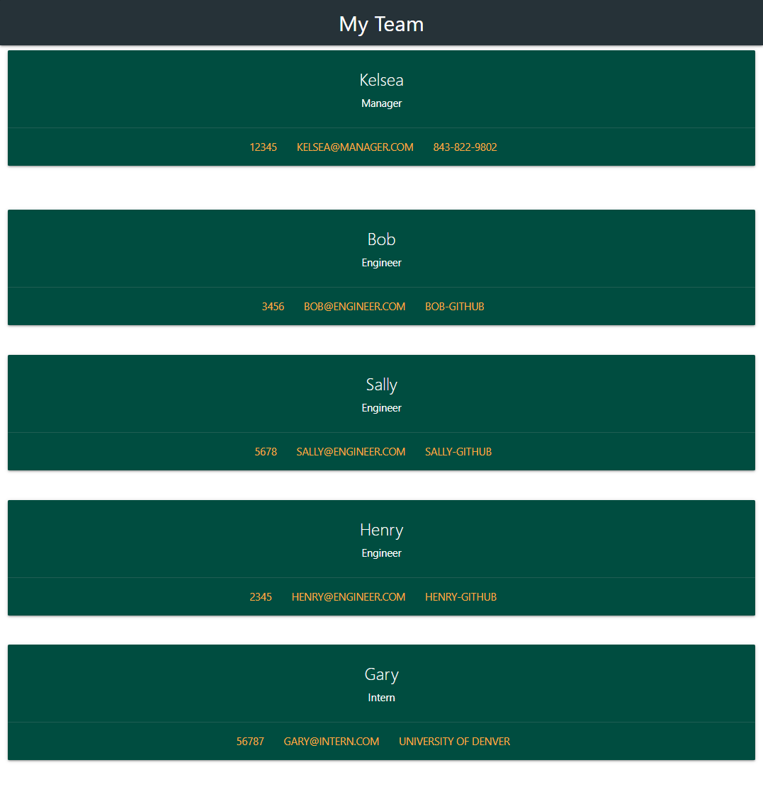
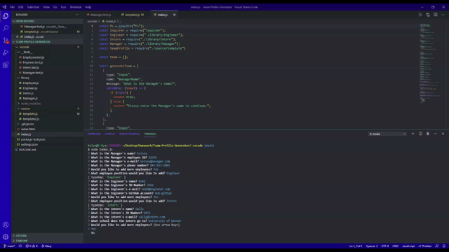

# Team-Profile-Generator

## What is this project about?

This project we were tasked to create a team profile generator.  Once the user goes through all of the prompts, it will create a HTML file with the given information.  They will have the option of having 1 manager, multiple engineers, and multiple interns added to their team.

## Installations

* You must install 'inquirer NPM' in order to have this function properly.

## Usages

* Node.js

## Licenses

## Contributors

Kelsea Hunt

## Screenshots/GIFs of Application

Here is a link to the video walkthrough:
https://drive.google.com/file/d/1r0ZVdQv9KNcJvqi8G1Yvb86ivB22Wo4S/view